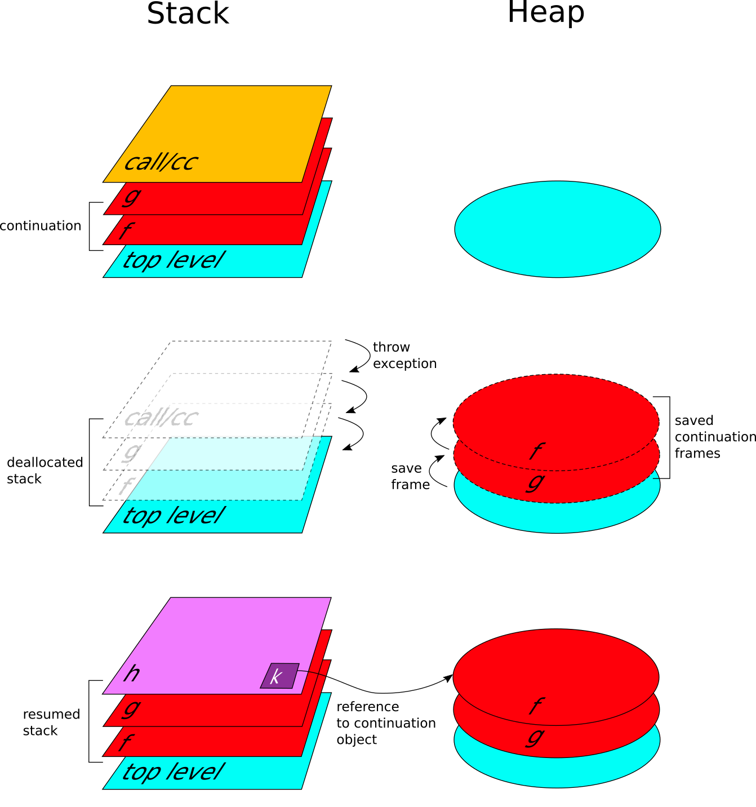
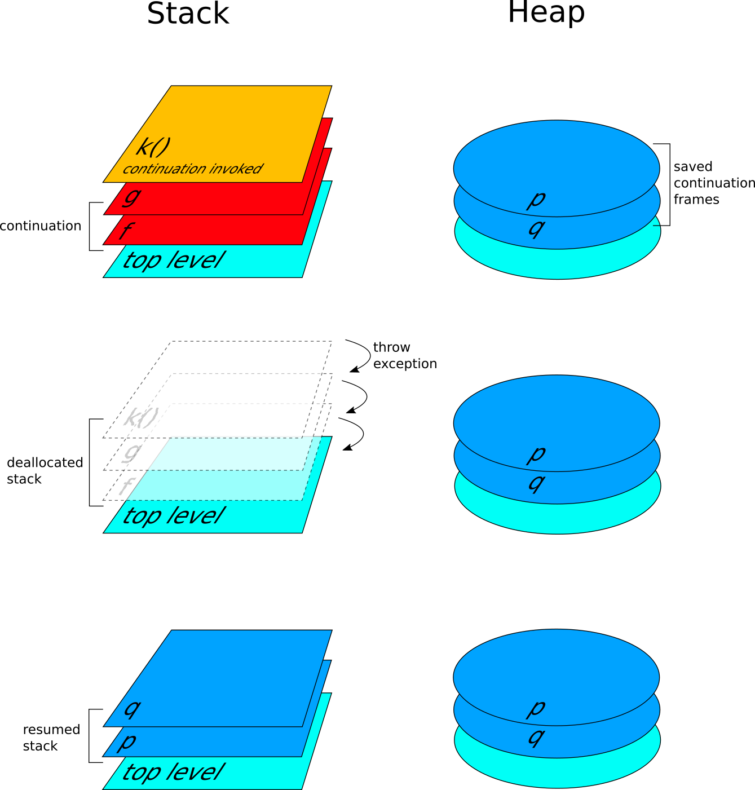

# Implementing first-class continuations on the JVM

> *"I don't care what anything was designed to do. I care about what it can do."*
\begin{flushright}
Apollo 13 (film, 1995)
\end{flushright}

## The stack manipulation dilemma
The use of virtual machines for the implementation of programming languages has become the norm in recent compiler developments. Unlike low-level languages, such as C, that permit access to the stack through use of pointer arithmetic, higher level languages, such as Java or C# do not provide instructions for installing and saving the run-time stack. Compiling Scheme, or any other language that uses first-class continuations to the JVM thus poses a challenging problem. At at first glance, the implementors must either give up implementing continuations or manage a heap-stored stack. The first choice limits the programmers of these languages, besides automatically making the Scheme implementation non standard-compliant. The second choice precludes many of the advantages that these machines supposedly offer. Indeed, the major problem with heap allocation of call frames and environments is the overhead associated with the use of a heap. This overhead includes the direct cost of allocating objects in the heap when building the call frames and environments, and of following references instead of increasing and decreasing a stack or frame pointer when accessing pieces of the frame or environment. The overhead also includes the indirect cost of garbage collection to manage stack frames and environments and the indirect cost of using significant amounts of memory. Furthermore, the use of the heap rather than a stack prevents the exploitation of commonly available hardware or microcode-supported stack push, pop and index instructions and the use of function call and return instructions.

## A solution: generalises stack inspection
The idea is to fragment the original program in a sequence of atomic computations, than to throw an exception to unwind the stack, and use the same exception to store the list of computations that constitute the stack portion to be captured. This list of computations can be later used to restate the entire continuation. As an example, consider stack of nested function calls in Figure \ref{stack}. At top level we call `topLevel`, that in turn calls `f`, which calls `g`, which call `call/cc` with `h` as argument. `h` is a function that takes one argument. Each call is enclosed in an exception handler that catches a `ContinuationException`.


When the `call/cc` is called, it creates a new `ContinuationException` object, adds the computation associated to `h` to the list, and throws the exception. Just after the `throw`, the execution stops and the JVM searches routines in the stack for an exception handler. The first `try`/`catch` expression found, that is in `g`, extends the list with an other computation and re-throws the exception.


The exception goes past the try block to try blocks in an outer scope. At each step a new computation is added to the `ContinuationException`, until the control goes to  the top level exception handler, which assembles the actual exception object. Searching in outer scopes for exception handlers is called a *stack walk*. While the stack unwinds, the JVM pops the stack frames off of the stack, destroying all the stack allocated variables. However, as all the computation steps are saved in the `ContinuationException`, a copy of the stack is progressively created on the heap. The exception always maintains a reference to the list of computations during the stack walk, so that the continuation is not garbage-collected.

The top level handler, besides assembling the continuation object, resumes the execution of `h`, the function passed to the `call/cc`, passing to it the continuation as argument. If `h` does not invoke the continuation, the top level handler resumes the continuation after `h` returns. Figure \ref{stack-mod} illustrates the process.



Figure \ref{frames} shows what happens in the stack and in the heap when a continuation is captures by `call/cc`. When `call/cc` is called the stack frames belonging to the continuation are under the `call/cc`'s one (assuming the stack growing bottom-up). Throwing the `ContinuationException` `call/cc` starts to unwind the stack, and consequently the heap starts to be populated by the continuation frames. When top level is reached, the handler creates the continuation object. At the end of the process, the `h` function is resumed with the continuation object bound to its single argument.



An interesting property of first-class continuations is that they can be invoked at any time, provided that they are saved in an accessible variable. When a continuation is invoked, it throws an `ExitException`. This causes the stack to be unwind, as in the capture case. The top level handler in this case resumes the continuation frames stored in the continuation object. The final result is that the execution restart where it was suspended by the call/cc, while the heap continues to store the continuation object. This can be accessed other times, or can be garbage-collected if it is no more used.

## Generalised stack inspection for a JVM-based Scheme
This section shows how the generalised stack inspection technique described by Pettyjohn et al. can be adapted to be used on the JVM, and how it can be included in a Scheme compiler. We will see also how some issues leaved open by the original paper have been tackled.

### Assignment conversion
In our case, this step is not necessary. Indeed, management of shared variable bindings is an orthogonal issue with respect to our global transformation, and it is shared between all the languages that provide lexical closures. Kawa already supports lexical closures, so has its way of managing variable bindings. For each closure, Kawa creates a new class to represent a function together with the environment of captured variables.

### A-Normalization
The first step of the process is to transform the source to A-normal form. ANF was introduced by Flanagan et al. in [@Flanagan1993] as an intermediate representation for compilers. It encodes data flow explicitly by naming all sub-expressions within the program and permitting only a single definition of any particular variable. The paper by Flanagan et al. also presents a basic linear-time A-normalization algorithm for a subset of scheme. The algorithm can be easily extended to handle top-level defines and side effects [@ANFMight2015]. Being Kawa a super-set of R7RS Scheme and having also many Java related extensions, the code of the original a-normalizer must be further extended. Instead of performing the transformation directly on the Scheme source, I opted for performing it on the abstract syntax tree, as it already uses a reduced set of expression types.

The following code shows an instance of the transformation in three steps. The *return* operation corresponds to the identity function, while the *bind* operation is a function that constructs let bindings to make every atomic computation explicit (the bind here has the same purpose as the `normalizeName` function in the Flanagan et al. paper).

The syntax tree is traversed starting from the root, and each non-atomic expression is passed to the bind with another parameter, called context (the very first context is the identity function that returns its argument). The context is a function that can be invoked. When the visiting process reaches a non-atomic expression a new context is created, and the passed context is called only inside the new one. The new bind function has two purposes:

1. to create a context, that generates a `let` expression to let-bind the expression next to come in the traversing process;
2. to visit the passed expression, to continue the syntax tree traversing.

This chain finish when a leaf (an atomic expression) is encountered in the tree, in this case the passed context is invoked (which in turn will invoke the previous context and so on). At this point the chain of context invocations starts to wrap each expression in a `let` binding, processing the expressions backward, and enclosing them step by step in nested `let` expressions. This backward traversing stops when the context called is the identity function. This happens in the leaves.

When the expression to normalize is a conditional, the bind is used on each branch expression. Instead of creating a let binding for each branch, as they cannot be evaluated before the test outcome, bind calls the visit method with the identity context, restarting the normalization in each branch.

The following code shows the a-normalization process for a simple Scheme expression. Note that the internal `if` expression should be further normalized, but we consider it atomic here, to keep the example short.
The algoritm performs a monadic transformation combining three steps:

1. Monadic conversion:

```scheme
   (+ 1                             (bind (if (>= x 0)
      (if (>= x 0)                            (f x)
          (f x)             -->               (return 0))
          0))                             (lambda (t) (+ 1 t)))
```

2. The result is interpreted in the identity monad:

```scheme
                (return a)  =>  a

   (bind a (lambda (x) b))  =>  (let ((x a)) b)


   (bind (if (>= x 0)               (let ((t (if (>= x 0)
             (f x)          -->                  (f x)
             (return 0))                         (return 0))))
          (lambda (t) (+ 1 t)))        (+ 1 t))
```

3. Nested let are flattened:

```scheme
   (let ((x (let ((y a))               (let ((y a))
              b)))          -->          (let ((x b))
     c)                                    c))
```

### Code fragmentation
This transformation, working on code previously a-normalized, fragments the code in a sequence of function calls. Each let-bind expression is enclosed in a lambda closure that accepts one argument. The argument is an other lambda closure that has in the body the call to the next code fragment. In this way the original source is rewritten as a sequence of function calls, each call representing a computation step. This way of fragmenting the source allows to avoid defining many top level procedures, that would also require an additional pass to perform live variable analysis.

An example of the entire transformation is showed below:

1. original source

```scheme
    (define incr #f)

    (+ (call/cc
          (lambda (k)
              (set! incr k)
              0))
      1) ; => 1
```

2. after a-normalization

```scheme
    (let ((v1 (lambda (k)              ; computation #1
	        (let ((v0 (set! incr k)))
	          0))))
     (let ((v2 (call/cc v1)))          ; computation #2
       (+ v2 1))))                     ; computation #3
```

3. after fragmentation

```scheme
    ((lambda (incr_an1)                ; fragment #1
      (let ((v1 (lambda (k)
	              (let ((v0 (set! incr k)))
		            0))))
         (incr_an1 v1)))
     (lambda (v1)
       ((lambda (incr_an2)             ; fragment #2
          (let ((v2 (call/cc v1)))
	        (incr_an2 v2)))
        (lambda (v2)
          (+ v2 1)))))                 ; fragment #3
```
### Live variable analysis and closure conversion
Kawa's support for lexical closures allows to completely avoid these steps. Each fragment, created as described in the previous section, is closed over the values of the variables that are live at that point.

A continuation will be composed of a series of frames. A *frame* is an object with a method that accepts a single value (the argument to the continuation) and invokes the appropriate procedure fragment, to continue the computation from the capture point. Also these frames will be closed over the live variables.

### Code Instrumentation
Beside fragmentation, instrumentation is performed installing exception handlers around each computation step to enable the capture and resume of continuations. Kawa supports `try-catch` expressions, which are translated directly to native `try/catch` statements in Java bytecode. A `try-catch` expression is created around each computation to capture a possible `ContinuationException`. The installed exception handler adds a new frame (an invokable object enclosing a call the next computation step) to the list of frames included inside the `ContinuationException` object, than rethrows the exception.

The following code resembles the final result after instrumentation:

```scheme
    ((lambda (incr_an1)
      (let ((v1 (lambda (k)
	              (let ((v0 (set! incr k)))
		            0))))
         (incr_an1 v1)))
     (lambda (v1)
       ((lambda (incr_an2)
          (let ((v2 (try-catch (call/cc v1)             ; try/catch
		              (cex <ContinuationException>      ; handler
		                 (let ((f (lambda (continue-value)
					         (incr_an2 continue-value))))
			             (cex:extend (<ContinuationFrame> f))
			             (throw cex))))))               ; re-throw
	        (incr_an2 v2)))
        (lambda (v2)
          (+ v2 1)))))
```

## Issues
### `call/cc` in higher order functions
Because Kawa optimise some built-in procedures (like `map`, `foreach` and `filter`) implementing them as Java methods, and because of the global transformation needed by the `call/cc`, continuations cannot be captured inside functions passed to those higher order functions.  Indeed, the Java implementation of map (`gnu.kawa.functions.Map`) is not 'aware' of continuations, thus when you use `call/cc` inside the lambda passed to `map`, it will not be able to handle a `ContinuationException`, resulting in a runtime error.

In the next chapter, we will see a possible solution to this problem.

### Code size
The creation of fragments will introduce a number of extra code. Although the overhead should be small, there will be an increase in code size proportional to the number of code fragments.

Code instrumentation introduces a number of `try/catch` blocks. This, will also increase code size proportional to the number of code fragments.

### Integration
Given that the code transformation needed to support continuations adds a overhead to the compilation process and the generated bytecode, is necessary to implement a-normalization and instrumentation as optional passes, that can be enabled only when we want to use `call/cc`. This adds the challenge of integrating such a global transformation in Kawa, avoiding to make too many changes to the compiler.
