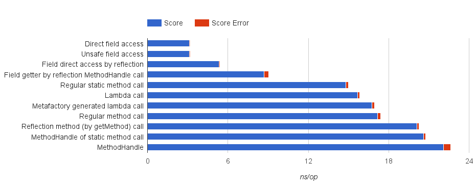

# A call/cc implementation for Kawa

> *"Do... or do not. There is no try."*
\begin{flushright}
The Empire Strikes Back (film, 1980)
\end{flushright}

## An instance of the transformation in Java
As a first preliminary step, I ported the C# code in [@StackHack2005] to Java, to study the feasibility of the technique on the JVM. The code represents a single instance of the transformation for a simple fibonacci function, and implements some support functions and data structures. Given that the global transformation fragments the original source in many function calls, I produced four versions of the transformed code, to compare the performance of different type of calls on the JVM:

1. The first one uses nested static classes to implement the continuation frames of the function to be run:

```java
    class fib_frame0 extends Frame {

        int x;

        public fib_frame0(int x) { this.x = x; }
        @Override
        public Object invoke(Object return_value)
                throws ContinuationException, Throwable {
            // call to the next fragment
            return fib_an0(x);
        }
    }

	public int fib_an(int x)
		  throws ContinuationException, Throwable {
        try {
            pause();
        } catch (ContinuationException sce) {
            sce.extend(new ContinuationFrame(new fib_frame0(x)));
            throw sce;
        }

        return fib_an0(x);
    }
```

2. the second version uses `MethodHandle`s, that were introduced in Java 7. A `MethodHandle` is a typed, directly executable reference to an underlying method, constructor or field:

```java
    static Object fib_frame0_invoke(Object x, Object continue_value)
            throws SaveContinuationException, Exception {
         return fib_an0 ((int) x);
    }

    static MethodHandle fib_frame0(int x)
            throws Exception {
		MethodType mt = MethodType.methodType(Object.class,
		                                      Object.class,
		                                      Object.class);
	    MethodHandle handle = lookup.findStatic(fib_mh.class,
	                                            "fib_frame0_invoke",
		                                        mt);

        return handle.bindTo(x);
    }

	public static int fib_an(int x)
		   throws SaveContinuationException, Exception {
        try {
            pause();
        } catch (SaveContinuationException sce) {
            sce.Extend(new ContinuationFrame(fib_frame0(x)));
            throw sce;
        }

        return fib_an0(x);
    }
```

3. the third version uses Java 8 lambdas, specified with the new Java syntax:

```java
    static Object fib_frame0_invoke(Object x, Object continue_value)
            throws SaveContinuationException, Exception {
         return fib_an0 ((int) x);
    }

    static Frame fib_frame0(int x)
            throws Exception {
        Frame f = (Object continue_value)
                    -> { return fib_frame0_invoke(x, continue_value);};

        return f;
	}

    public static int fib_an(int x)
            throws SaveContinuationException, Exception {
        try {
            pause();
        } catch (SaveContinuationException sce) {
            sce.Extend(new ContinuationFrame(fib_frame0(x)));
            throw sce;
        }

        return fib_an0(x);
    }

```

4. the last version generates lambdas explicitly using LambdaMetafactory, an API introduced in Java 8 to facilitate the creation of simple function objects.

```java
	fib_frame0_factory
		= LambdaMetafactory
            .metafactory(lookup,
                         "invoke",
                         invokedType,
                         methodType,
                         lookup.findStatic(fib_meta.class,
							               "fib_frame0_invoke",
								           implType),
                         methodType).dynamicInvoker();

    static Object fib_frame0_invoke(Object x, Object continue_value)
            throws SaveContinuationException, Throwable {
         return fib_an0 ((int) x);
    }

    static Frame fib_frame0(int x)
            throws Throwable {
        return (Frame) fib_frame0_factory.invoke(x);
    }
```

I tested each type of method call with JMH [@jmh2015; @BenchmarkingJVM2015], a benchmarking framework for the JVM. Figures \ref{calls-table, calls} show the results. The lambda case is quite fast, if compared with MethodHandles, but also the explicit use of LambdaMetafactory gives good results, provided that the call to LambdaMetafactory.metafactory is cached in a static field. However, the difference in performance between lambda calls and regular method calls is negligible. Thus is not worth to re-design a significant part of the compiler, and to loose the compatibility with previous version of the JVM, for such a small improvement.




### Exceptions performance in Java
The capture of a continuation, and in particular the stack copying mechanism, is driven by exception throwing and exception handling. Therefore, is crucial to understand how the installation of exception handlers and the construction of an Exception object impact the performance.

In Java, when throwing an exception, the most expensive operation is the construction of the stack trace, that is useful for debugging reasons. As well as we are not using exceptions with they original purpose, we can have rid of the stack trace construction and optimise the `Exception` object. It is sufficient to override the `fillInStackTrace` method of `Throwable`:

```java
    public static class FastException extends Exception {

        @Override
        public Throwable fillInStackTrace() {
            return this;
        }
    }
```

I performed a straightforward benchmark, comparing the time spent by a regular method call, a method call surrounded by an exception handler, a method call throwing a cached exception and a method call throwing a `FastException`.

```java
        // case 1
		t.method1(i);

        // case 2
		try {
			t.method2(i);
		} catch (Exception e) {
			// We will *never* get here
		}

        // case 3
		try {
			t.method3(i);
		} catch (Exception e) {
			// We will get here
		}

        // case 4
		try {
			t.method4(i);
		} catch (FastException e) {
			// We will get here
		}
```

The results from 10 million iterations are shown in the following table.

|                    | time (ms) |
|--------------------|-----------|
| regular            | 1225      |
| non cached         | 1240      |
| catched            | 35482     |
| catched, optimised | 1330      |

As you can see, to catch a `FastException` introduces a negligible overhead, while instantiating an `Exception` with its stack trace is more than an order of magnitude more expensive.

## Support code
For capturing and resuming continuations we need a framework to support all the required operations, such as construct an object that models the continuation, and turn a continuation object back into an actual continuation.

```java
    public static class ContinuationFrame {

        Procedure computation;
        ArrayList<ContinuationFrame> continuation;

        public ContinuationFrame(Procedure frame) {
            computation = frame;
        }
    }
```

The basic blocks of a continuation are its `ContinuationFrame`s. A `ContinuationFrame` (for brevity, a frame) is a simple data structure which contains a single computation (a `Procedure` that takes one argument), and a list of `ContinuationFrame`s. The list is used by the next capture of a continuation. All the frames needed to assemble a continuation are collected using a `ContinuationException`. This class extends `FastException` and stores the list of frames which is extended step by step by the chain of throws. It contains also a list of frames that have been already reloaded by a previously call to `call/cc`. When the exception reaches the top level exception handler, this calls the method `toContinuation` that builds a new `Continuation` object using the two lists.

```java
    public static class ContinuationException extends FastException {

        ArrayList<ContinuationFrame>
        newCapturedFrames = new ArrayList<ContinuationFrame>();

        ArrayList<ContinuationFrame> reloadedFrames;

        public void extend(ContinuationFrame extension) {
            newCapturedFrames.add(extension);
        }

        public void append(ArrayList<ContinuationFrame> oldFrames) {
            reloadedFrames = oldFrames;
        }

        public Continuation toContinuation() throws Exception {
            return new Continuation(newCapturedFrames,
                                    reloadedFrames);
        }
    }
```

The `Continuation` constructor takes the two lists and assembles the continuation.

```java
public class Continuation extends Procedure0or1 {

    ArrayList<ContinuationFrame> frames;

    public Continuation(ArrayList<ContinuationFrame> newFrames,
                        ArrayList<ContinuationFrame> oldFrames) {

        frames = (oldFrames != null)
                 ? new ArrayList<ContinuationFrame>(oldFrames)
		         : new ArrayList<ContinuationFrame>();

        for(int i = newFrames.size()-1; i >= 0; i--) {
            ContinuationFrame newFrame = newFrames.get(i);
            if (newFrame.continuation != null) {
                throw new Error("Continuation should be empty here");
            }
            newFrame.continuation
			    = new ArrayList<ContinuationFrame>(frames);
            frames.add(newFrame);
        }
    }
```

When a continuation is invoked, we actually call the `apply` method of `Continuation`. Here we create a new procedure which, when called, resumes the continuation. We wrap the procedure in an exception so that, throwing it, we unload the *current* continuation. The top level handler will receive this exception and will use it to resume the *invoked* continuation.

```java
    public Object apply0() throws Throwable {
        return apply1(Values.empty);
    }

    public Object apply1(final Object val) throws Throwable {

        Procedure t = new Procedure1() {

            public Object apply1(Object ignored) throws Throwable {
                return reloadFrames(frames.size()-2, val);
            }
        };

        throw new ExitException(t);
    }
```

The `Continuation` object also contains the method to resume the continuation. `reloadFrames` iterates over the list of frames in reverse order to re-establish the saved continuation reconstructing the stack. The topmost frame gets the restart value passed into it.

```java
    Object resume(final Object restartValue) throws Throwable {
        return reloadFrames(frames.size()-1, restartValue);
    }

    Object reloadFrames(int endIndex, Object restartValue)
    throws Throwable {
        Object continueValue = restartValue;
        for (int i = endIndex; i >= 0; i -= 1) {
            ContinuationFrame frame = frames.get(i);
            try {
                continueValue = frame.computation.apply1(continueValue);
            } catch (ContinuationException sce) {
                sce.append(frame.continuation);
                throw sce;
            }
        }
        return continueValue;
    }

}
```

`TopLevelHandler` deals with running top level calls in an exception handler that catches instances of `ContinuationException`, thrown by `call/cc`, and `ExitException`, thrown by a continuation invocation. In the first case it creates a continuation object and resumes the execution of the function passed to `call/cc`. In the second case it calls the function enclosed in the `ExitException`, which reinstates the continuation.

```java
public class TopLevelHandler extends Procedure1 {

    public Object apply1(Object arg1) throws Throwable {
        return runInTopLevelHandler((Procedure) arg1);
    }

    public void compile(...) { ... }

    public static Object runInTopLevelHandler(Procedure initialFrame)
    throws Throwable {
        while (true) {
            try {
                return invokeFrame(initialFrame);
            } catch (ExitException rce) {
                initialFrame = rce.thunk;
            }
        }
    }

    private static Object invokeFrame(final Procedure initialFrame)
    throws Throwable {
        try {
            return initialFrame.apply1(null);
        } catch (ContinuationException sce) {
            final Continuation k = sce.toContinuation();

            Procedure f = new Procedure1() {

                public Object apply1(Object arg) throws Throwable {
                    return k.resume(k);
                }
            };

            throw new ExitException(f);
        }
    }
}
```

The `CallCC` procedure implements `call/cc`. It throws a new `ContinuationException`, saving in it the `call/cc` argument (a `Procedure` object).

```java
public class CallCC extends Procedure1 {

    public Object apply1(Object arg1) throws Throwable {
        return call_cc((Procedure) arg1);
    }

    public void compile(...) { ... }

    public static Object call_cc(final Procedure receiver)
    throws ContinuationException {
        try {
            throw new ContinuationException();
        } catch (ContinuationException sce) {
            sce.extend(new ContinuationFrame(receiver));
            throw sce;
        }
    }
}
```

A significant variation with respect to the implementation proposed by Pettyjohn et al. is that the function that resumes the stack frames is implemented using iteration instead of recursion. This avoids using to much stack, as the JVM, differently from the C# MSIL, does not support tail call optimisation. Another difference is in the representation of the list of frames. Instead of using a linked list adding elements at the beginning, I used a Java `ArrayList`, adding elements at the end of the list. This allows to avoid reversing a list at every capture, and saves an object allocation at each list extension.

## A brief overview of Kawa's compilation process
In Kawa there are mainly five compilation stages [@Bothner1998]:

1. Syntactic analysis - the first compilation stage reads the source input. The result is one or more Scheme forms (S-expressions), represented as lists.

2. Semantic analysis - the main source form is rewritten into a set of nested `Expression` objects, which represents Kawa's *abstract syntax tree* (AST). For instance, a `QuoteExp` represents a literal, or a quoted form, a `ReferenceExp` is a reference to a named variable, an `ApplyExp` is an application of a procedure func to an argument list and a `LetExp` is used for let binding forms. The Scheme primitive syntax lambda is translated into a `LambdaExp`. Other sub-classes of `Expression` are `IfExp`, used for conditional expressions, `BeginExp`, used for compound expressions and `SetExp`, used for assignments. The top-level `Expression` object is a `ModuleExp` and can be considered the root of the AST. This stage also handles macro expansion and lexical name binding.

3. Optimisation - an intermediate pass performs type-inference and various optimisation, such as constant folding, dead code elimination and function inlining.

4. Code generation - the `ModuleExp` object is translated into one or more byte-coded classes. This is done by invoking a `compile` method recursively on the `Expression`s, which generates JVM instructions using the bytecode package, writing out the resulting class files.

5. Loading - if the code is compiled and then immediately executed, the compiled code can be immediately turned into Java classes using the Java `ClassLoader` feature. Then the bytecode can be loaded into the Kawa run-time.


## A-Normalization
I created a new `ExpVisitor` that manipulates the syntax tree implementing the transformation to ANF, already described in chapter 3. An `ExpVisitor` is Java class that can be extended to implement code that traverses the AST to apply a certain transformation. The new visitor, called `ANormalize`, performs the A-normalization pass just before the optimisation stage of the compiler.

```java
[... parsing ...]

ANormalize.aNormalize(mexp, this); // <-- A-normalization
InlineCalls.inlineCalls(mexp, this);
ChainLambdas.chainLambdas(mexp, this);
FindTailCalls.findTailCalls(mexp, this);

[... code generation  ...]
```

At first, we call the visit function on root of the AST, passing as context the identity function.

```java
public static void aNormalize(Expression exp, Compilation comp) {
	[...]
    visitor.visit(exp, identity);
}
```

The core of the A-normalizer is the `bind` function, already introduced in Chapter 3, here called `normalizeName`. `normalizeName` creates a new context, then it will visit the expression with this new context. If the passed expression is atomic (cannot be further normalized), like a literal or an identifier, the new context calls the old context with the expression as input. Otherwise it creates a new `let` expression, binds the expression to a new variable in the `let` (with `genLetDeclaration`), then replaces every occurrence of the expression in the code with a reference to the just created variable (with `context.invoke(new ReferenceExp(decl))`).

```java
protected Expression normalizeName(Expression exp,
	                               final Context context) {
    Context newContext = new Context() {
        @Override
        Expression invoke(Expression expr) {
            if (isAtomic(expr))
                return context.invoke(expr);
            else {
                // create a new Let
                LetExp newlet = new LetExp();

                // create a new declaration in the let, using
                // the new expression value
                Declaration decl = genLetDeclaration(expr, newlet);

                // occurrences of expr in the next computation are
                // referenced using the new declaration
                newlet.body = context.invoke(new ReferenceExp(decl));
                return newlet;
            }
        }
    };

    return visit(exp, newContext);
}

```

When the expression to normalize is a conditional, as its branches cannot be evaluated before the test outcome, we use `normalizeName` on each branch expression. Instead of creating a new variable for each branch, we restart the normalization in each branch.

```java
protected Expression visitIfExp(final IfExp exp,
                                final Context context) {
    Context newContext = new Context() {

        @Override
        Expression invoke(Expression expr) {
            exp.then_clause = normalizeTerm(exp.then_clause);
            exp.else_clause = (exp.else_clause != null)
                              ? normalizeTerm(exp.else_clause)
                              : null;

            exp.test = expr;

            return context.invoke(exp);
        }
    };
    return normalizeName(exp.test, newContext);
}
```

When an atomic expression is encountered in the tree, the passed context is directly invoked with expression passed as argument. At this point the chain of context invocations starts to wrap each expression in a let binding, traversing the AST backward, nesting each non atomic expression in a new `let`.

```java
protected Expression visitQuoteExp(QuoteExp exp,
                                   Context context) {
    return context.invoke(exp);
}

protected Expression visitReferenceExp(ReferenceExp exp,
                                       Context context) {
    return context.invoke(exp);
}
```

## Code fragmentation
Another `ExpVisitor`, `FragmentAndInstrument`, performs the fragmentation and the instrumentation. As described in Chapter 3, the new visitor transforms the code in a sequence function calls. At the same time it wraps in a `try-catch` expression every atomic computation it encounters in the traversing. This stage is inserted between the A-normalization and the optimisation pass.

```java
[... parsing ...]

ANormalize.aNormalize(mexp, this);
FragmentAndInstrument.fragmentCode(mexp, this);// <-- fragmentation
                                              //and instrumentation
InlineCalls.inlineCalls(mexp, this);
ChainLambdas.chainLambdas(mexp, this);
FindTailCalls.findTailCalls(mexp, this);

[... code generation ...]
```

The transformation starts at the root of the AST (a `ModuleExp`), and continues analysing each node of the tree recursively. The most relevant method in `FragmentAndInstrument` is `visitLetExp`, which deals with the transformation of `let` expressions.

```java
protected Expression visitLetExp(LetExp exp, Void ignored) {
    Declaration letDecl = exp.firstDecl();
    Expression nextExp = exp.body;
    Expression continueValue = letDecl.getInitValue();
```

After A-normalization the code is mainly made by nested `let` expression that bind to a variable every atomic computation. `visitLetExp` takes a `LetExp` and transforms it in two closures, applying the first to the second one. The former closure executes an atomic computation and calls the latter closure. The latter closure contains the original body of the `let` expression, which will be further fragmented. Using the example from chapter 3:

```scheme
    ((lambda (incr_an1)        ;   <--   closure #1
      (let ((v1 (lambda (k)
	              (let ((v0 (set! incr k)))
		            0))))
         (incr_an1 v1)))
     (lambda (v1)              ;  <--   closure #2
       ((lambda (incr_an2)
          (let ((v2 (call/cc v1)))
	        (incr_an2 v2)))
        (lambda (v2)
          (+ v2 1)))))
```

The following code creates the first closure. It simply generates a new lambda expression that takes an argument. The original `LetExp` becomes the body of the lambda.

```java
Declaration nextFragmentDecl = new Declaration("continue-fragment");
LambdaExp fragment = new LambdaExp(1);
fragment.body = exp;
fragment.addDeclaration(nextFragmentDecl);
```

We replace the let body with the call to the next fragment, that is `(incr_an1 v1)` in the previous Scheme example.

```java
exp.body = new ApplyExp(applyRef,
                        new ReferenceExp(nextFragmentDecl),
                        new ReferenceExp(letDecl));
```

The code that creates the second closure is very similar to which that generates the first one. It is an other new lambda expression that takes an argument. The body this time is the body of the original `LetExp`.

```java
Declaration continueValueDecl = new Declaration("continue-value");
LambdaExp nextFragment = new LambdaExp(1);
nextFragment.body = nextExp;
nextFragment.addDeclaration(continueValueDecl);
```

We create a new function call, which applies the first lambda to the second one.

```scheme
    ((lambda (incr_an1)        ;   <--   closure #1
      ...)
     (lambda (v1)              ;  <--   closure #2
       ...))
```

```java
ApplyExp fragmentCall = new ApplyExp(fragment,
                                     nextFragment);
```

Then we can move one to annotate with a `try-catch` the `let` binding (see next section), and to traverse the rest of the tree calling visit on the body of the second lambda.

```java
Expression annotatedExp = visitAndAnnotate(continueValue,
                                           nextFragmentDecl);
letDecl.setInitValue(annotatedExp);

// visit the rest of the code.
nextFragment.body = visit(nextFragment.body, ignored);

return fragmentCall;
```

## Code Instrumentation
First of all, each top level expression is wrapped inside a `TopLevelHandler` call, which surrounds the expression with an exception handler, as seen in Chapter 3.

```java
protected Expression visitModuleExp(ModuleExp exp, Void ignored) {

    if (exp.body instanceof ApplyExp
        && ((ApplyExp)exp.body).isAppendValues()) {
        ApplyExp body = ((ApplyExp)exp.body);
        for (int i = 0; i < body.args.length; i++) {
            body.args[i] = installTopLevelHandler(visit(body.args[i],
		                                                ignored));
        }
        return exp;
    }

    exp.body = installTopLevelHandler(visit(exp.body, ignored));

    return exp;
}

```

Then we perform the main part of instrumentation in the `visitAndAnnotate` method, which we call on every `let` binding, as shown in the previous section. In `visitAndAnnotate`, we create a `TryExp` and an exception handler that catches `ContinuationException`s.

```java
private Expression visitAndAnnotate(Expression exp,
                                    Declaration nextFragmentDecl) {
    TryExp annotatedExp = new TryExp(exp, null);
    Declaration handlerDecl = new Declaration((Object) null,
                                              contExpceptionType);
    ReferenceExp handlerDeclRef = new ReferenceExp(handlerDecl);
```

We also create the frame needed to extend the `ContinuationException`. The frame computation is a lambda which contains the call to the next fragment. Then we can generate the code to create a `ContinuationFrame` with the lambda just created. The lambda will be translated to a `Procedure` object at runtime.

```scheme
(try-catch (call/cc v1)             ; try/catch
  (cex <ContinuationException>      ; handler
	(let ((f (lambda (continue-value)
		       (incr_an2 continue-value))))
	  (cex:extend (<ContinuationFrame> f))
	  (throw cex))))                ; re-throw
```

```java
Declaration argDecl = new Declaration("continue-value");
ApplyExp nextFragmentCall = new ApplyExp
                                 (new ReferenceExp(nextFragmentDecl),
                                  new ReferenceExp(argDecl));

Expression frame = createFrame(argDecl, nextFragmentCall);

ApplyExp cframe = new ApplyExp(contFrameClass,
                               frame);
ApplyExp extend = new ApplyExp(new PrimProcedure("Helpers",
							                     "extend", 2),
                               handlerDeclRef,
                               cframe);
```

The last thing to generate is the re-throw instruction for the caught `ContinuationException`. Eventually, we visit the annotated exp to continue the tree traversing.

```java
ApplyExp throwApply = new ApplyExp(primitiveThrow,
                                   handlerDeclRef);
Expression begin = new BeginExp(extend, throwApply);
annotatedExp.addCatchClause(handlerDecl, begin);

// visit the wrapped expression
annotatedExp.try_clause = visit(annotatedExp.try_clause, null);
return annotatedExp;
```

## Other control operators: delimited continuations

The transformation and the support code described in this chapter is not only suitable to implement `call/cc`, but can also be employed to implement other control operators.

### Prompts and barriers

#### `call-with-continuation-prompt`

#### `call-with-continuation-barrier`

### `shift` and `reset`
I introduced `shift` and `reset` operators and delimited continuations in Chapter 1. `call/cc` can be used to implement those two operators, as shown by Filinsky et al. in [@Filinski1994]. The following code is a port of their SML/NJ implementation:

```scheme
	(define (escape f)
      (call/cc (lambda (k)
	             (f (lambda x
		              (apply k x))))))

    (define mk #f)

    (define (abort x) (mk x))

    (define (%reset t)
      (escape (lambda (k)
	            (let ((m mk))
	              (set! mk (lambda (r)
			                 (set! mk m)
			                 (k r)))
	              (abort (t))))))

    (define (shift h)
      (escape (lambda (k)
	            (abort (h (lambda v
			                (%reset (lambda ()
				                      (apply k v)))))))))

    (define-syntax reset (syntax-rules ()
        ((reset exp ...)
         (%reset (lambda () exp ...)))))

```

### Native `shift` and `reset`
Although we can implement delimited continuations using `call/cc`, we can avoid unnecessary overhead implementing `shift` and `reset` in Java, modifying the existing `call/cc` implementation.

## Higher order functions
To support the capture of continuations inside higher order functions, it is possible to add them, or at least the most common ones, in a module that is transformed for `call/cc` support end included in the compiler. I defined a Scheme version of `map` and `for-each`, which I added in the standard library of Kawa to experiment the applicability of this technique. The module in which those functions are implemented is compiled with the continuations transformation enabled (this can be done using `(module-compile-options full-continuations: #t)`). Moreover, when a Scheme source file is compiled with the full `call/cc` enabled, the compiler replaces the higher order functions with the instrumented version. This allows to capture continuations inside those functions.

## Selective transformation
