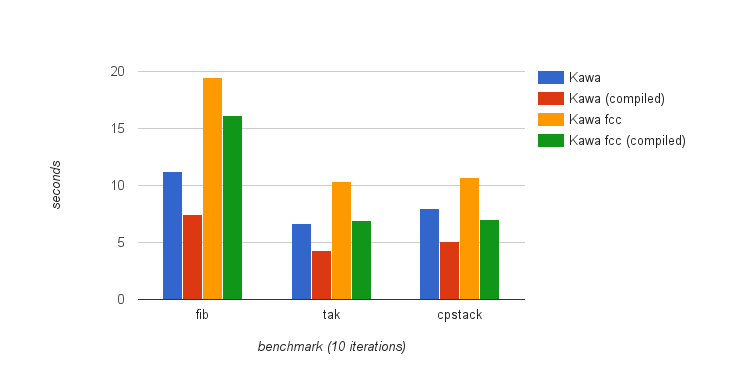
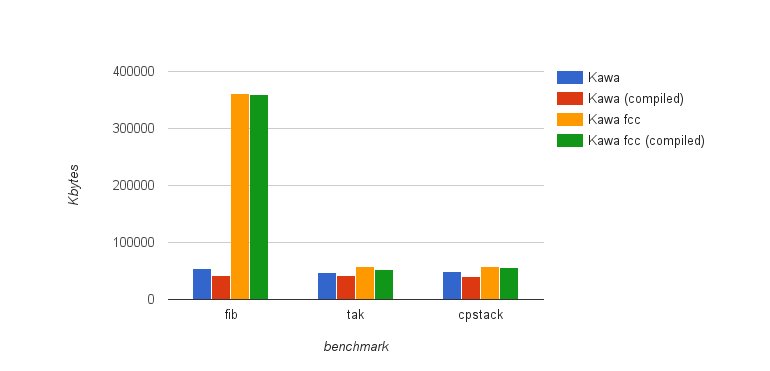
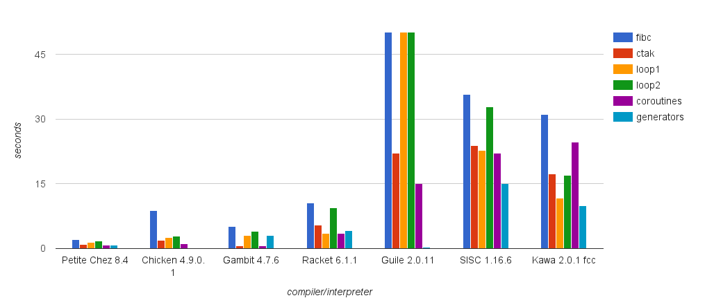
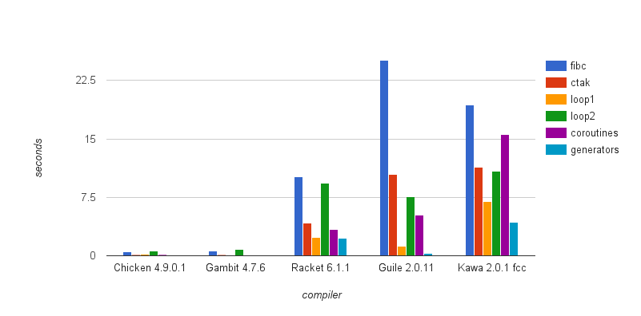
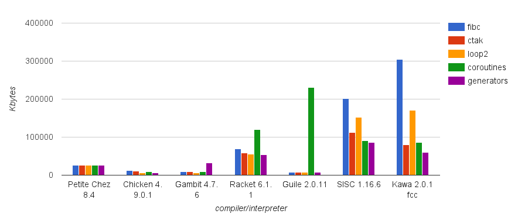
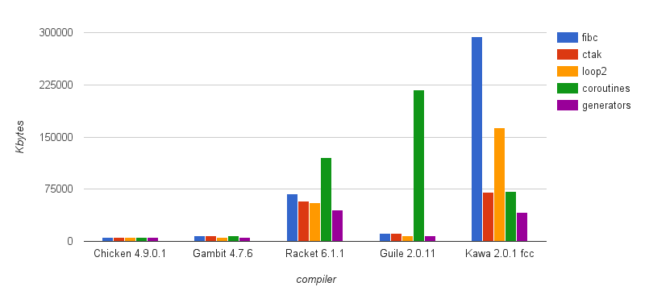
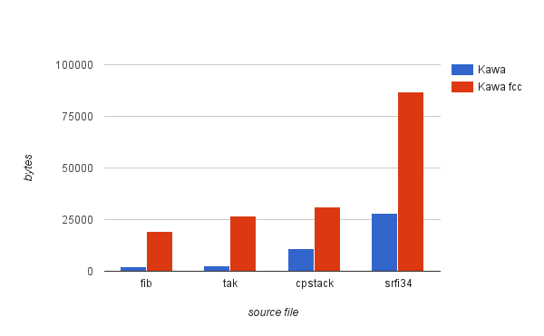

# Evaluation

> *“Extraordinary claims require extraordinary evidence.”*
\begin{flushright}
Carl Sagan, Encyclopedia Galactica
\end{flushright}

## Transformation overhead
We saw in the previous chapters how we can implement `call/cc` in a JVM targeting compiler, performing a transformation on the whole source to instrument the original code. We would like to know how this global transformation impacts the overall performances of the program when no continuations are captured. We already observed that exception handlers are not expensive on the JVM, but there are other variables to take in consideration. The code fragmentation implies an increase on the number of function calls, which can reduce performance.

I used a set of benchmarks to analyse the behaviour of the running code in the case of both transformed code and non-transformed code. All the benchmarks were executed on an Intel i5 dual-core processor with 4GB of RAM (i5-2410M , 2.30GHz).The operating system was Debian GNU/Linux. The table in Figure \ref{overhead-table} and the chart in Figure \ref{overhead} show the results.

The `fib` benchmark runs a simple Fibonacci function with 30 as input. `tak` implements the Takeuchi function and runs it with 18, 12, 6. `cpstak` is a version of `tak` rewritten in continuation passing style. We can observe that the transformation introduces a considerable overhead, especially in the `fib` benchmark.

To understand from where this overhead comes from, I profiled the execution of the fib benchmark using HPROF, a profiling tool provided by the Java platform. Considering the cpu usage data (Figure \ref{cpu}), we can observe that approximately 10% of the cpu time is spent allocating `Proceure` objects (`gnu.mapping.Procedure.<init>` and `gnu.expr.ModuleMethod.<init>`).

We can reach the same conclusions analysing the heap usage. Figure \ref{heap} shows which objects are more often allocated during the execution of `fib`.

Almost 40% of the heap is used to store object of type `ModuleMethodWithContext`, that is the runtime object in which closures are allocated. This is not unexpected, as the transformed code is fragmented in a set of closures. However, this suggest that a possible improvement for the technique can be obtained optimising closure allocation.

## `call/cc` performance
I tested the new `call/cc` implementation on five continuation-intensive benchmarks. `fibc` is a variation of `fib` with continuations. The `loop2` benchmark corresponds to a non-local-exit scenario in which a tight loop repeatedly throws to the same continuation. The `ctak` benchmark is a continuation-intensive variation of the call-intensive `tak` benchmark. The `ctak` benchmark captures a continuation on every procedure call and throws a continuation on every return. In addition to `fibc` `loop2` and `ctak`, already used in [@Clinger1999], I used a benchmark based on coroutines, and an other implementing a generator.

I compared the modified version of Kawa with other Scheme implementations with an interpreter or JIT compiler, targeting either native machine code or an internal VM:

* Petite Chez Scheme is a sibling version of Chez Scheme, a proprietary Scheme implementation. Petite is a threaded interpreter and can be used free of charge.

* Chicken is a Scheme to C compiler, but also an interpreter.

* Gambit is a Scheme implementation, which has both and interpreter and a compiler that produces C code.

* Guile is an interpreter and compiler for Scheme, using a virtual machine that executes a portable instruction set generated by its optimizing compiler, and integrates very easily with C and C++ application code.

* Racket is a programming language based on standard Scheme, but includes way more features in the base language, It also offers an IDE and a large number of built in libraries and tools.

* SISC is a Scheme interpreter written in Java, and running on the JVM. SISC is also the only other JVM Scheme supporting `call/cc`.

Some of the Scheme implementations introduced above can pre-compile code to a bytecode or binary format, which can be later executed without paying the cost for translation. Figures \ref{compiled-tab} and \ref{compiled} compares the execution time of code compiled by five compilers, including the modified version of Kawa.

Looking at the benchmarks' outcome we can see that Kawa with first-class continuations (Kawa fcc), despite the overhead we measured in the previous section, performs slightly better then SISC. As expected, Kawa fcc performances are far from the Scheme to C compilers, however, when compared with Guile and Racket they are within the same order of magnitude.

## `call/cc` memory usage
I measured peak memory usage of the same five benchmarks introduced in the performance section, testing the same range of compilers. This time Kawa fcc performs similarly to SISC, except for the `fibc` benchmark. Kawa fcc also uses a similar amount of memory similar to racket in the `coroutines`, `generators` and `ctak` benchmarks. Chez and Scheme to C compilers have performances unreachable for implementations using a VM, both in interpreted and compiled modes.

I repeated the same benchmarks using pre-compiled code. However, with relation to memory usage, the differences between interpreted vs compiled code is negligible.

## Code size
We saw in Chapter 3 that we expect an increase in code size proportional to the number of code fragments, so we want to measure the actual difference in size between a regular class file and an instrumented one. Figure \ref{codesize-tab} shows a comparison of regular code and transformed code.

We can observe that the size of transformed code can be 10 times larger than the code compiled without first-class continuations enabled. Even if the code size increase is proportional to the number of fragments, the difference in size is significant. This indicates that would be better to limit the use of transformed code to modules that needs `call/cc`, and use `call/cc` enabled code in combination with non-transformed code.

