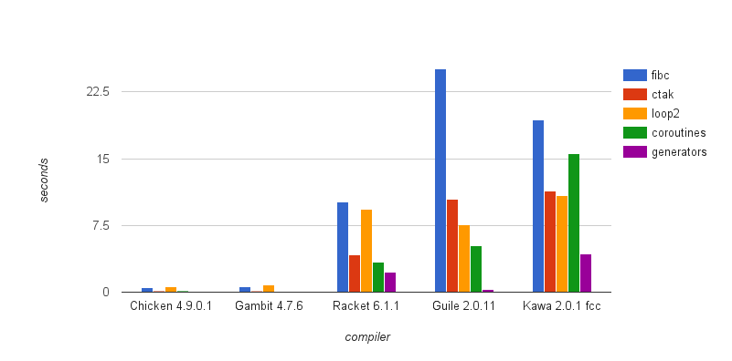

# Evaluation

> *“Extraordinary claims require extraordinary evidence.”*
\begin{flushright}
Carl Sagan, Encyclopedia Galactica
\end{flushright}

## Transformation overhead
We saw in the previous chapters how we can implement `call/cc` on a JVM targeting compiler, performing a transformation on the whole source to instrument the original code. We would like to know how this global transformation impacts the overall performances of the program when no continuations are captured. We already observed that exception handlers are not expensive on the JVM, but there are other variables to take in consideration. The code fragmentation implies an increase on the number of function calls, which can reduce performance.

I used a set of benchmark to analyse the behaviour of the running code in the case both transformed code and non-transformed code. The table in Figure \ref{overhead-table} and the chart in figure \label{overhead} show the results.

The `fib` benchmark runs a simple fibonacci function with 30 as input. `tak` implements the Tak function and runs it with 18, 12, 6. `cpstak` is a version of tak rewritten in continuation passing style.

## Capturing performance

## Code size

